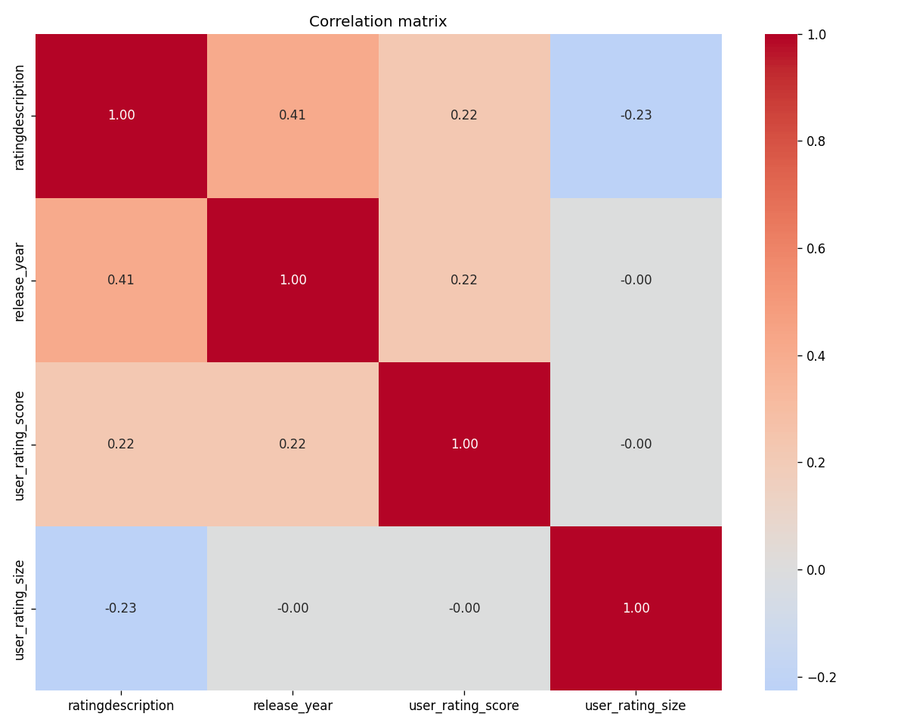

#  LangGraph Multi-Agent Data Analytics System

A fully automated AI-powered data analytics pipeline built with LangGraph and OpenAI. Upload any CSV file and get a complete analysis — profiling, cleaning, EDA, visualizations, and a professional report — all generated automatically by 8 specialized AI agents.

---

##  What It Does

Upload any CSV file → 8 AI agents automatically:

-  **Profile** the dataset — nulls, types, distributions
-  **Detect** data quality issues and rank by severity
-  **Clean** the data — impute nulls, fix text, drop duplicates
-  **Explore** patterns — test 8 statistical hypotheses
-  **Critique** findings — quality check all EDA results
-  **Visualize** — generate 10+ professional charts
-  **Report** — write a full executive markdown report
-  **Log** — save complete JSON audit trail

---

##  Web Interface

- Upload any CSV from browser
- Watch agents run live
- View all charts in browser
- Download full report
- See complete agent log

---

##  The 8 Agents

| # | Agent | Job |
|---|-------|-----|
| 1 | Supervisor | Routes between agents, controls loops |
| 2 | Profiler | Scans dataset — nulls, types, distributions |
| 3 | Quality | Detects issues, ranks severity, proposes fixes |
| 4 | Cleaning | Applies fixes, logs every transformation |
| 5 | EDA | Generates and tests 8 hypotheses, finds patterns |
| 6 | Critic | Reviews EDA findings for quality and validity |
| 7 | Visualization | Picks chart types, generates PNG files |
| 8 | Reporter | Writes final markdown report and JSON audit log |

---

##  Tech Stack

| Tool | Purpose |
|------|---------|
| Python 3.11+ | Core language |
| LangGraph | Multi-agent graph framework |
| LangChain | LLM orchestration |
| OpenAI GPT-4o | AI brain for all agents |
| FastAPI | Web server backend |
| pandas / numpy | Data processing |
| matplotlib / seaborn | Chart generation |
| scipy | Statistical tests |
| LangSmith | Observability and tracing |
| uvicorn | ASGI server |

---

##  Project Structure
